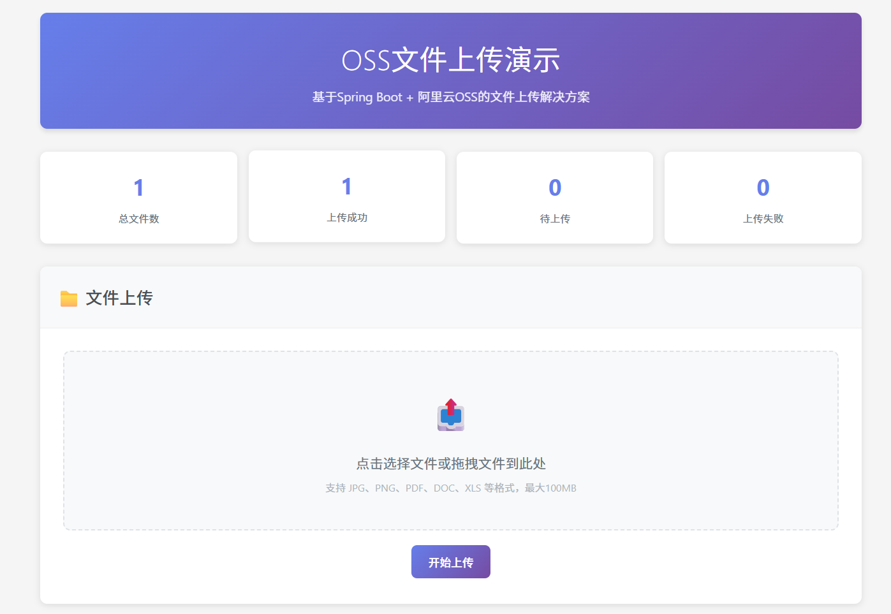
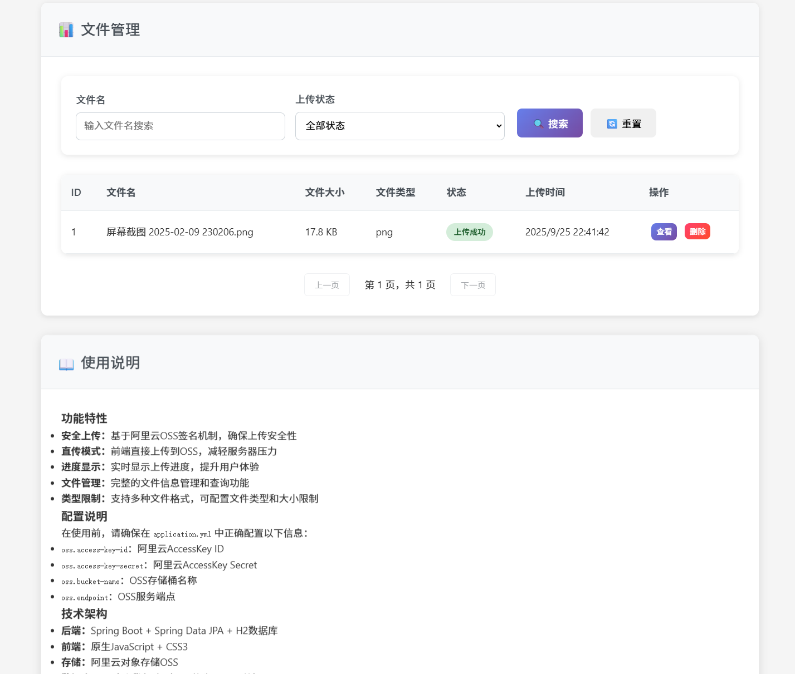

# OSS文件上传演示项目

基于Spring Boot + 阿里云OSS的文件上传解决方案，支持前端直传、签名验证、进度显示等功能。

## 🚀 功能特性

- **安全上传**：基于阿里云OSS签名机制，确保上传安全性
- **直传模式**：前端直接上传到OSS，减轻服务器压力
- **进度显示**：实时显示上传进度，提升用户体验
- **文件管理**：完整的文件信息管理和查询功能
- **类型限制**：支持多种文件格式，可配置文件类型和大小限制
- **响应式设计**：支持PC和移动端访问

## 🛠️ 技术栈

- **后端**：Spring Boot 2.7.14 + Spring Data JPA + H2数据库
- **前端**：原生JavaScript + CSS3
- **存储**：阿里云对象存储OSS
- **构建工具**：Maven

## 📋 项目结构

```
oss-upload-demo/
├── src/
│   ├── main/
│   │   ├── java/com/example/ossupload/
│   │   │   ├── config/           # 配置类
│   │   │   ├── controller/       # 控制器
│   │   │   ├── dto/             # 数据传输对象
│   │   │   ├── entity/          # 实体类
│   │   │   ├── repository/      # 数据访问层
│   │   │   ├── service/         # 服务层
│   │   │   └── OssUploadApplication.java
│   │   └── resources/
│   │       ├── static/          # 静态资源
│   │       │   ├── css/
│   │       │   └── js/
│   │       ├── templates/       # 模板文件
│   │       └── application.yml  # 配置文件
├── pom.xml
└── README.md
```

## ⚙️ 配置说明

### 1. OSS配置

在 `src/main/resources/application.yml` 中配置OSS相关信息：

```yaml
oss:
  endpoint: https://oss-cn-hangzhou.aliyuncs.com  # OSS服务端点
  access-key-id: YOUR_ACCESS_KEY_ID               # 替换为你的AccessKey ID
  access-key-secret: YOUR_ACCESS_KEY_SECRET       # 替换为你的AccessKey Secret
  bucket-name: YOUR_BUCKET_NAME                   # 替换为你的存储桶名称
  signature-expire-time: 3600                     # 签名有效期（秒）
  max-file-size: 104857600                        # 最大文件大小（100MB）
  allowed-file-types: jpg,jpeg,png,gif,pdf,doc,docx,xls,xlsx,ppt,pptx,txt,zip,rar
```

### 2. 数据库配置

项目默认使用H2内存数据库，如需使用MySQL等其他数据库，请修改配置：

```yaml
spring:
  datasource:
    url: jdbc:mysql://localhost:3306/oss_demo
    username: root
    password: your_password
    driver-class-name: com.mysql.cj.jdbc.Driver
```

## 🚀 快速开始

### 1. 环境要求

- JDK 8+
- Maven 3.6+
- 阿里云OSS账号

### 2. 获取阿里云OSS配置

1. 登录[阿里云控制台](https://oss.console.aliyun.com/)
2. 创建OSS存储桶
3. 获取AccessKey ID和AccessKey Secret
4. 配置存储桶的跨域规则（CORS）

### 3. 配置CORS规则

在OSS控制台中，为你的存储桶配置以下CORS规则：

```json
[
  {
    "allowedOrigins": ["*"],
    "allowedMethods": ["GET", "PUT", "POST"],
    "allowedHeaders": ["*"],
    "exposeHeaders": ["ETag", "x-oss-request-id"],
    "maxAgeSeconds": 3600
  }
]
```

### 4. 运行项目

1. 克隆项目到本地
2. 修改 `application.yml` 中的OSS配置
3. 运行以下命令：

```bash
# 编译项目
mvn clean compile

# 运行项目
mvn spring-boot:run
```

4. 访问 http://localhost:9000

## 📖 API文档

### 获取上传签名

```http
POST /api/oss/signature
Content-Type: application/json

{
  "fileName": "example.jpg",
  "fileSize": 1024000,
  "contentType": "image/jpeg",
  "fileExtension": "jpg",
  "remark": "测试文件"
}
```

### 上传回调

```http
POST /api/oss/callback
Content-Type: application/json

{
  "fileInfoId": 1,
  "ossKey": "uploads/2023/12/25/abc123.jpg",
  "actualFileSize": 1024000,
  "uploadStatus": 1
}
```

### 文件列表查询

```http
GET /api/files?page=0&size=10&sortBy=createTime&sortDir=desc
```

## 🔧 自定义配置

### 文件类型限制

在 `application.yml` 中修改 `allowed-file-types` 配置：

```yaml
oss:
  allowed-file-types: jpg,jpeg,png,pdf  # 只允许图片和PDF
```

### 文件大小限制

```yaml
oss:
  max-file-size: 52428800  # 50MB
```

### 签名有效期

```yaml
oss:
  signature-expire-time: 1800  # 30分钟
```

## 🐛 常见问题

### 1. 上传失败，提示跨域错误

请检查OSS存储桶的CORS配置是否正确。

### 2. 签名验证失败

请检查AccessKey ID和AccessKey Secret是否正确，以及系统时间是否准确。

### 3. 文件上传后无法访问

请检查OSS存储桶的读权限设置，确保文件可以公开访问。

## 📝 开发说明

### 添加新的文件类型支持

1. 在 `application.yml` 中添加文件扩展名
2. 在前端 `app.js` 的 `validateFile` 函数中添加验证逻辑

### 自定义文件存储路径

修改 `OssService.java` 中的 `generateFileKey` 方法：

```java
private String generateFileKey(String originalFileName) {
    // 自定义路径规则
    SimpleDateFormat sdf = new SimpleDateFormat("yyyy/MM/dd");
    String datePath = sdf.format(new Date());
    
    String uuid = UUID.randomUUID().toString().replace("-", "");
    String extension = "";
    if (originalFileName.contains(".")) {
        extension = originalFileName.substring(originalFileName.lastIndexOf("."));
    }
    
    return "custom-path/" + datePath + "/" + uuid + extension;
}
```
## 🐰 预览




## 📄 许可证

本项目采用 MIT 许可证，详情请参阅 [LICENSE](LICENSE) 文件。

## 🤝 贡献

欢迎提交 Issue 和 Pull Request！

## 📞 联系方式

如有问题，请通过以下方式联系：

- 提交 GitHub Issue
- 发送邮件至：vonshine15@163.com

---

⭐ 如果这个项目对你有帮助，请给个星标支持一下！